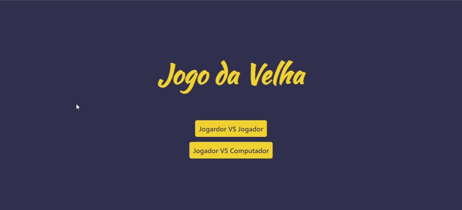

<div align="center">

  <h1># Jogo da Velha #</h1>

  We go play the Tic-Tac-Toe

</div>

## 📷 Demo
<div align="center">

  
  

  <h3>

   #️⃣ [PLAY TIC-TAC-TOE](https://nicolasrafaelduma.github.io/JogoDaVelha/) #️⃣

  </h3>
</div>

## ℹ About the project
Who never played the Tic-Tac-Toe? Different of the original game, here you can choose your emoji and also you can play against the computer.

### Credits
This project is created on course [Desenvolvimento Web - Programador Br](https://programadorbr.com/).

### I went beyound
I add a lot of new functions, like choose emojis, play against the computer and restart game.


## 🚀 Technologies

-  HTML
-  CSS
-  JavaScript

## ⚙ Getting started
1. Install the [Git](https://git-scm.com/) on your machine.

2. Clone the repository:
```
git clone https://github.com/nicolasrafaelduma/JogoDaVelha
```

3. I recommend that you use an IDE or a good text editor like [VSCode](https://code.visualstudio.com/).

## 📄 License
[MIT License](https://github.com/nicolasrafaelduma/JogoDaVelha/blob/master/LICENSE)
